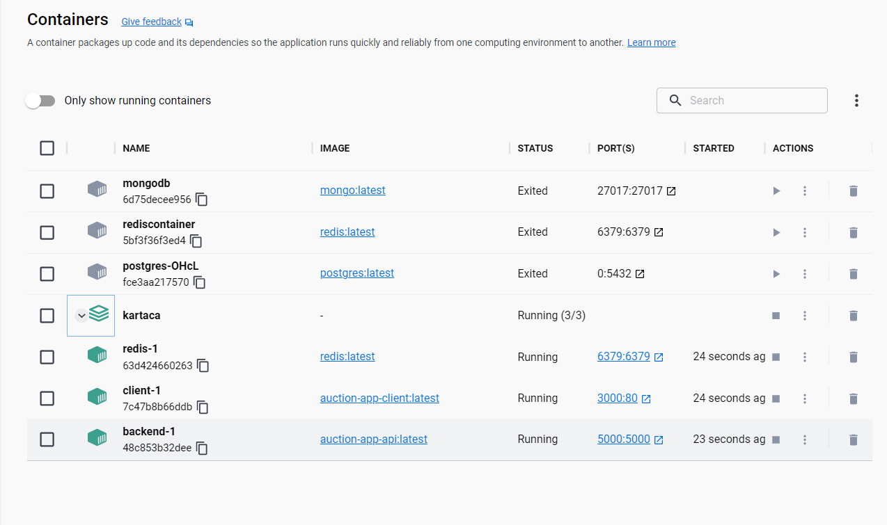

# Auction App

### About

Temel seviyede kullanıcı üyeliği yapılabilen, oturum açma ve kapatma özelliklerine sahip bir web projesi geliştirilmiştir. Oturum açan kullanıcılar, anasayfa üzerinde 3 adet ürün gösterilmektedir. Bir istek sağlayıcısı ile yeni ürünler eklenebilmektedir. Oturum açmamış kullanıcılar ise oturum açmaya yönlendirilmektedir. Bu ürünlere canlı olarak açık artırma yapılıp, teklif verilebilmektedir. Bir başka kullanıcı, canlı olarak bu açık artırmayı takip edip, sayfayı yenilemeden güncel fiyatı görebilmektedir. MCV mimari tasarım deseni uygulandı. Monolitik bir mimari ile api canlıya alındı.

### Built With

- [![JS][js-img]][js-url]
- [![React][react.js]][react-url]
- [![Python][python-img]][python-url]
- [![Flask][flask-img]][flask-url]
- [![Sqllite][sqllite-img]][sqllite-url]
- [![Redis][redis-img]][redis-url]

### Getting Started

---

#### Prerequisites

- [Docker](https://docs.docker.com/engine/install/)
- [Docker-Compose](https://docs.docker.com/compose/install/)

#### Installation

1. Clone the repo
   ```
       git clone https://github.com/enesonmez/auction-app.git
   ```
2. Docker installation
   ```
       docker-compose up
   ```
   Docker ui'ında aşağıdaki gibi bir görüntü olması gerekmektedir.
   

### Usage

---

#### Auction App Api

Gerekli kullanım dokümantasyonu için [tıklayınız.](https://documenter.getpostman.com/view/17762144/2s93RWPX6S) Localhost 5000 portunda api hizmet vermektedir.

#### Auction App Client

Localhost 3000 portunda client hizmet vermektedir.


### Owner

---

#### Enes Sönmez

- [![Github][github-img]][github-url]
- [![Linkedin][linkedin-img]][linkedin-url]
- [![Haccerrank][haccerrank-img]][haccerrank-url]

#### RegistrationKey

6b5d11b1ed68c994ca17510c83a48ec1e609bc86588fe0f98100b0a0052f19f1

[js-img]: https://img.shields.io/badge/JavaScript-F7DF1E?style=for-the-badge&logo=javascript&logoColor=black
[js-url]: https://developer.mozilla.org/en-US/docs/Web/JavaScript
[react.js]: https://img.shields.io/badge/React-20232A?style=for-the-badge&logo=react&logoColor=61DAFB
[react-url]: https://reactjs.org/
[python-img]: https://img.shields.io/badge/Python-14354C?style=for-the-badge&logo=python&logoColor=whitelogo=python&logoColor=white
[python-url]: https://www.python.org/
[flask-img]: https://img.shields.io/badge/Flask-000000?style=for-the-badge&logo=flask&logoColor=white
[flask-url]: https://flask.palletsprojects.com/en/2.2.x/
[sqllite-img]: https://img.shields.io/badge/SQLite-07405E?style=for-the-badge&logo=sqlite&logoColor=white
[sqllite-url]: https://sqlite.org/index.html
[redis-img]: https://img.shields.io/badge/redis-%23DD0031.svg?&style=for-the-badge&logo=redis&logoColor=white
[redis-url]: https://redis.io/
[github-img]: https://img.shields.io/badge/GitHub-100000?style=for-the-badge&logo=github&logoColor=white
[github-url]: https://github.com/enesonmez
[linkedin-img]: https://img.shields.io/badge/LinkedIn-0077B5?style=for-the-badge&logo=linkedin&logoColor=white
[linkedin-url]: https://www.linkedin.com/in/enesonmez/
[haccerrank-img]: https://img.shields.io/badge/-Hackerrank-2EC866?style=for-the-badge&logo=HackerRank&logoColor=white
[haccerrank-url]: https://www.hackerrank.com/enesonmez
